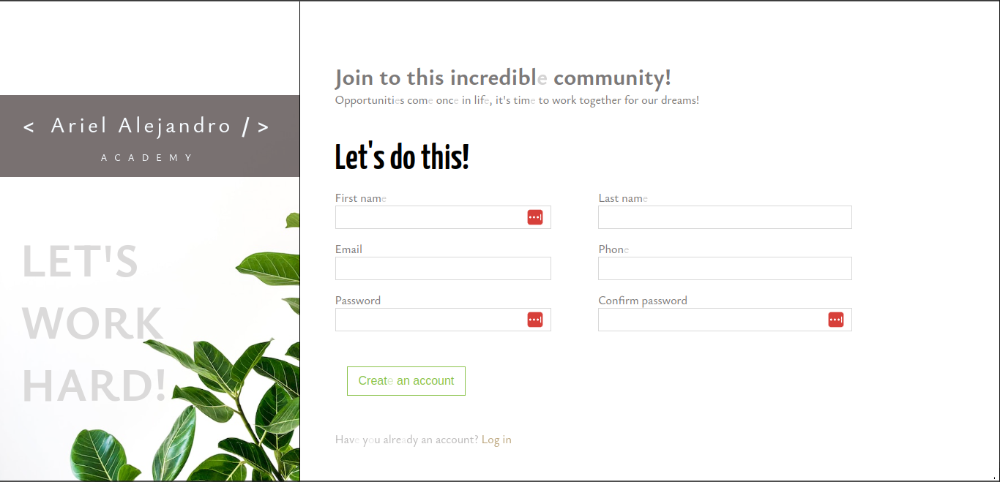

# Practice: Quick layout - registration form

This small project is part of my learning path to become a web developer. At this stage I'm learning the basic technologies of this area of programming.

## Technologies

    - HTML
    - CSS

## View

// Pending: Add validation with JS
