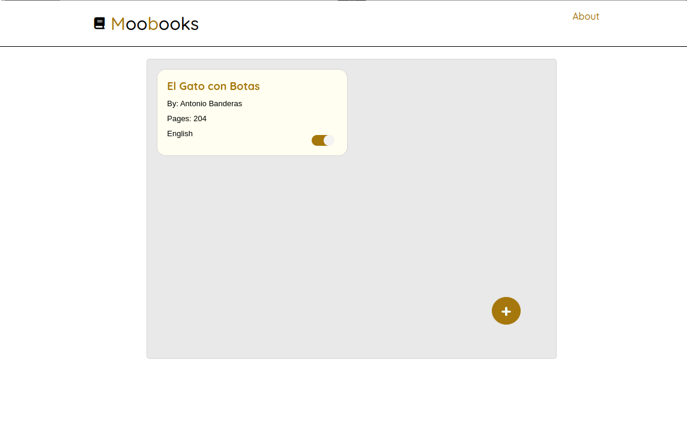

# Practice: Booklist

This small project is part of my learning path to become a web developer. At this stage I'm learning the basic technologies of this area of programming.

## View

## Technologies

    - HTML
    - CSS
    - JS

// It still has a lot of things to do, the first would be a redesign, plus the possibility to save your books in the localStorage and have bookmarks..
