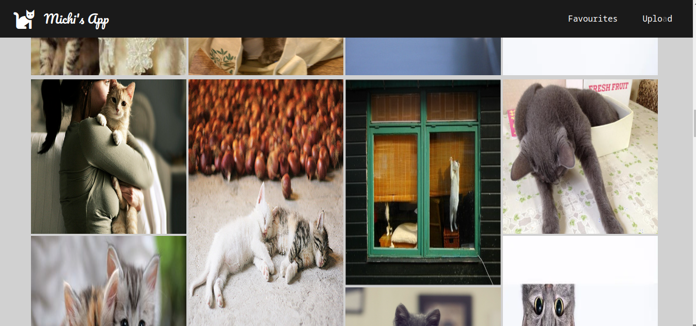

# Practice: Cats API - Photo Gallery

This small project is part of my learning path to become a web developer. At this stage I'm learning the basic technologies of this area of programming.

In this project I develop a communication flow between a simple frontend with an external API through asynchronous requests.

## View

## Technologies

    - HTML
    - CSS
    - JS
